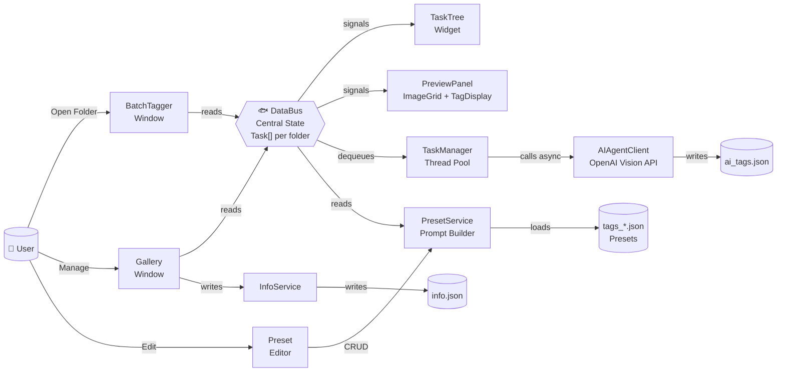
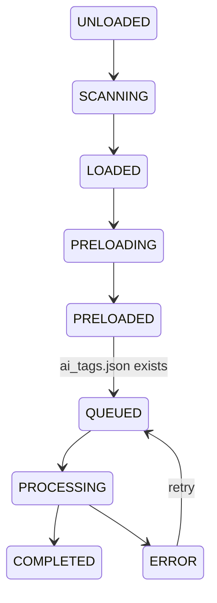

# Aiya ImgTagger

A desktop tool for creating Danbooru / E-Hentai style tag metadata for image galleries (anime, illustration, cosplay, 3D render). Uses a vision LLM to batch-analyze images and pre-select tags from user-definable preset templates, with a gallery manager for manual review and refinement.

## Architecture



> **Fishbone spine**: The DataBus is the central state hub. All UI components read from it via signals, and all kernel services connect through it. Files (json) are the terminal data sinks.

## Data Bus State Machine

Each subfolder under the entry directory is a **Task** tracked by the DataBus:



## Project Structure

```
aiya-imgtagger/
├── main.py                       # Unified entry point (--mode gallery|batch|editor)
├── config.py                     # Centralized configuration
├── run_batch_tag.py              # Launcher shortcut: Batch AI Tagger
├── run_tag_editor.py             # Launcher shortcut: Tag Template Editor
├── requirements.txt
│
├── kernel/                       # Core business logic
│   ├── models.py                 # Data models & TaskState enum
│   ├── bus.py                    # DataBus — central state + preload
│   ├── scanner.py                # Filesystem scanning
│   ├── storage.py                # ai_tags.json I/O
│   ├── info_service.py           # info.json CRUD (GalleryInfo)
│   ├── prompt_service.py         # Tag preset CRUD + system prompt builder
│   ├── agent.py                  # Vision LLM API client
│   └── task_manager.py           # Thread pool + agent dispatch
│
├── ui/                           # GUI layer (PyQt6)
│   ├── batch_window.py           # Batch AI Tagger window
│   ├── gallery_window.py         # Gallery Manager window
│   ├── gallery_tag_editor.py     # Tag editing panel (checkboxes)
│   ├── preset_editor.py          # Tag template editor
│   ├── task_tree.py              # Folder tree with [state] labels
│   ├── preview_panel.py          # Image preview + tag display
│   ├── tag_display.py            # Read-only tag chip widgets
│   └── flow_layout.py            # Custom wrapping FlowLayout
│
├── utils/
│   └── image_utils.py            # QPixmap loading & thumbnail cache
│
└── data/
    ├── tags_pixiv.json           # Anime illustration tags preset
    ├── tags_cosplay.json         # Cosplay photo tags preset
    └── tags_3d.json              # 3D render tags preset
```

## Output Files

| File | Location | Description |
|------|----------|-------------|
| `ai_tags.json` | Per subfolder | AI-generated tags with confidence scores |
| `info.json` | Per subfolder | Gallery metadata (title, category, custom tags) |

### ai_tags.json Format

```json
{
  "version": "1.0",
  "tags": {
    "parody": [{"value": "genshin impact", "confidence": 0.95, "confirmed": true}],
    "character": [{"value": "barbara", "confidence": 0.90, "confirmed": true}],
    "artist": [],
    "female": [{"value": "blonde_hair", "confidence": 0.88, "confirmed": true}],
    "male": [],
    "general": [{"value": "ocean_background", "confidence": 0.85, "confirmed": true}],
    "rating": [{"value": "safe", "confidence": 0.95, "confirmed": true}],
    "other": [{"value": "highres", "confidence": 0.95, "confirmed": true}]
  }
}
```

### info.json Format

```json
{
  "title": "Example Gallery",
  "category": "doujinshi",
  "language": "Chinese",
  "file_count": {"image": 44, "video": 2},
  "file_size": 438123456,
  "thumbnail": "./.thumb",
  "tags": {
    "parody": ["Blue Archive"],
    "character": ["Shiroko"],
    "artist": [],
    "female": ["glasses"],
    "male": [],
    "general": [],
    "rating": [],
    "other": ["full color"]
  }
}
```

## Tag Categories

| Category | Type | Description |
|----------|------|-------------|
| `parody` | Free-form | Source series or franchise |
| `character` | Free-form | Character names |
| `artist` | Free-form | Artist name |
| `female` | Preset-constrained | Female character features |
| `male` | Preset-constrained | Male character features |
| `general` | Preset-constrained | Visual traits (hair, eyes, etc.) |
| `rating` | Preset-constrained | Content rating |
| `other` | Preset-constrained | Meta qualities |

Free-form categories allow the AI to invent values. Preset-constrained categories restrict the AI to only select from the loaded tag template.

## Configurable in config.py

| Setting | Default | Description |
|---------|---------|-------------|
| `PRELOAD_TASK_COUNT` | `5` | Concurrent image preload workers |
| `AGENT_WORKER_COUNT` | `2` | Concurrent AI agent processing threads |
| `MAX_IMAGES_PER_REQUEST` | `6` | Images sent per API call (randomly sampled from each folder) |
| `MAX_IMAGE_WIDTH` | `1000` | Max width before API upload |
| `JPEG_QUALITY` | `85` | JPEG compression quality |
| `THUMB_SIZE` | `180` | Preview thumbnail pixel size |
| `GALLERY_CATEGORIES` | `["doujinshi","manga","imageset","cosplay","misc","private"]` | Gallery category radio options |

## Basic Usage

### 1. Batch AI Tagging

```bash
python run_batch_tag.py
# or
python main.py --mode batch
```

1. Click **Open Folder** and select the root directory containing image subfolders
2. Click **Refresh Models** to fetch available vision models from the API
3. Select a **Model** and optional **Template** (tag preset)
4. Click **Batch AI** to process all subfolders without existing `ai_tags.json`
5. Monitor progress in the status bar and task tree state labels

### 2. Gallery Manager (Dataset Editor)

```bash
python main.py --mode gallery
```

1. Open a folder — each subfolder appears in the tree with `[]` state labels
2. Click a folder to preview images and edit tags
3. Modify metadata (title, category via radio buttons, language, file counts)
4. Check/uncheck tags across all 8 categories
5. Click **Save** to write `info.json`; **Save && Next** to proceed

### 3. Tag Template Editor

```bash
python run_tag_editor.py
# or
python main.py --mode editor
```

1. Select an existing preset from the dropdown
2. Use the tabbed table to edit slugs, names, and descriptions
3. Add new tags via the input fields; delete with the `×` button
4. Click **New** to create a preset, **Delete** to remove one
5. Click **Save** to persist changes to `data/tags_{name}.json`

### Prerequisites

```bash
pip install -r requirements.txt
```

Create a `.env` file (script mode) **or** a `settings.json` next to the exe (frozen mode):

```
# .env
API_KEY=your-api-key
API_URL=https://your-api-endpoint/v1
```

```json
{
  "API_KEY": "your-api-key",
  "API_URL": "https://your-api-endpoint/v1"
}
```

> Config precedence: `settings.json` > `.env`/environment variables > defaults. When frozen into an exe, `BASE_DIR` (where `settings.json` and `data/` are read/written) points to the directory containing the executable, so presets and config persist outside the bundle. A blank `settings.json` is auto-generated on first launch of the frozen exe.

## Requirements

- Python 3.10+
- PyQt6 >= 6.5.0
- Pillow >= 10.0.0
- openai >= 1.0.0, < 2.0.0
- python-dotenv >= 1.0.0
